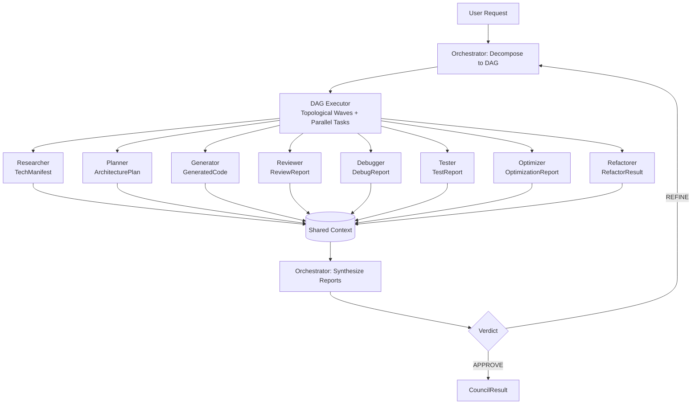

# SLM Coding Council

Many-to-One autonomous coding engine with a dynamic DAG orchestrator, specialist agents, and iterative refinement.

## What changed

The architecture has moved from a fixed 4-agent sequence to a dynamic graph executor:

- Orchestrator now decomposes work into DAG tasks with dependencies
- DAG executor runs dependency-safe waves in parallel
- Agent registry enables plug-in style agent discovery
- System supports 8 specialist roles at the model/schema/orchestration level
- Final response includes richer artifacts (architecture/review/optimization/refactor reports)

## Architecture (Mermaid)



## Agent roles

At runtime, roles are discovered through the registry and instantiated from settings.

| Role | Primary Output | Purpose |
|---|---|---|
| orchestrator | task DAG + verdict | Planning, synthesis, refine/approve decisions |
| researcher | TechManifest | dependencies, constraints, references |
| planner | ArchitecturePlan | components, file layout, data flow |
| generator | GeneratedCode | implementation files |
| reviewer | ReviewReport | style/security/best-practice review |
| debugger | DebugReport | bug tracing and fixes |
| tester | TestReport | tests, edge cases, coverage notes |
| optimizer | OptimizationReport | complexity and bottleneck analysis |
| refactorer | RefactorResult | structural cleanup while preserving behavior |

## Current configuration status

Code supports 8 roles, but default settings currently preconfigure the original 4 endpoint-backed specialists:

- researcher
- generator
- debugger
- tester

Additional roles (planner/reviewer/optimizer/refactorer) are wired in orchestration and schemas, and can be activated by adding their settings fields/values in `src/slm_council/config.py` and `.env`.

## Core flow

1. Request enters `POST /council/run`
2. Orchestrator creates DAG tasks (`id`, `agent`, `instruction`, `dependencies`)
3. DAG executor validates graph (duplicate IDs, missing deps, cycles)
4. Tasks execute in topological waves with semaphore-based concurrency limits
5. Outputs are propagated to shared context for dependent tasks
6. Orchestrator synthesizes all reports and decides APPROVE or REFINE
7. On REFINE, orchestrator emits refinement DAG and loop continues (bounded by max passes)
8. Final `CouncilResult` includes outputs + execution metadata

## Project structure

```text
slm_council/
├── src/slm_council/
│   ├── config.py
│   ├── models.py
│   ├── server.py
│   ├── agents/
│   │   ├── base.py
│   │   ├── registry.py
│   │   ├── researcher.py
│   │   ├── planner.py
│   │   ├── generator.py
│   │   ├── reviewer.py
│   │   ├── debugger.py
│   │   ├── tester.py
│   │   ├── optimizer.py
│   │   └── refactorer.py
│   ├── orchestrator/
│   │   ├── brain.py
│   │   ├── dag.py
│   │   └── loop.py
│   ├── knowledge/
│   │   ├── base.py
│   │   └── style.py
│   ├── feedback/
│   │   └── base.py
│   └── utils/
│       ├── prompts.py
│       └── logging.py
├── tests/
├── .env.example
├── pyproject.toml
└── README.md
```

## API

| Method | Path | Description |
|---|---|---|
| GET | `/` | basic service info |
| GET | `/health` | health check |
| POST | `/council/run` | run full council loop |
| GET | `/config/agents` | runtime model/endpoint config visibility |

### Example request

```json
{
  "query": "Build a Python binary search utility with tests",
  "language": "python",
  "context": {},
  "max_iterations": 3
}
```

### Example response shape (abridged)

```json
{
  "session_id": "...",
  "status": "pass|partial|fail",
  "code": {"files": []},
  "tech_manifest": {},
  "architecture_plan": {},
  "review_report": {},
  "debug_report": {},
  "test_report": {},
  "optimization_report": {},
  "refactored_code": {},
  "agents_used": ["researcher", "generator", "tester"],
  "dag_execution_order": [["t1", "t2"], ["t3"]],
  "refinement_passes": 1,
  "total_duration_secs": 0.0,
  "summary": "..."
}
```

## Quick start

### 1) Install

```bash
git clone <repo-url> && cd slm_council
python -m venv .venv && source .venv/bin/activate  # or .venv\Scripts\activate on Windows
pip install -e ".[dev]"
```

### 2. Configure

```bash
cp .env.example .env
# Edit .env with your GCP project ID and endpoint URLs
```

### 3. Run locally (with Docker Compose)

> Requires NVIDIA Container Toolkit for GPU-backed agents.

```bash
docker compose up --build
```

The gateway will be available at `http://localhost:8080`.

### 4. Run the API server only (agents hosted elsewhere)

```bash
python -m slm_council
# or
uvicorn slm_council.server:app --host 0.0.0.0 --port 8080
```

### 4) Call API

```bash
curl -X POST http://localhost:8080/council/run \
  -H "Content-Type: application/json" \
  -d '{"query":"Create a typed Python LRU cache","language":"python"}'
```

## Notes

- This repo currently prototypes with API-based model calls.
- Architecture is modular for future local embedding/vector-memory integration.
- `knowledge/` and `feedback/` modules are extension interfaces (ABCs) for upcoming personalization features.

## License

MIT
